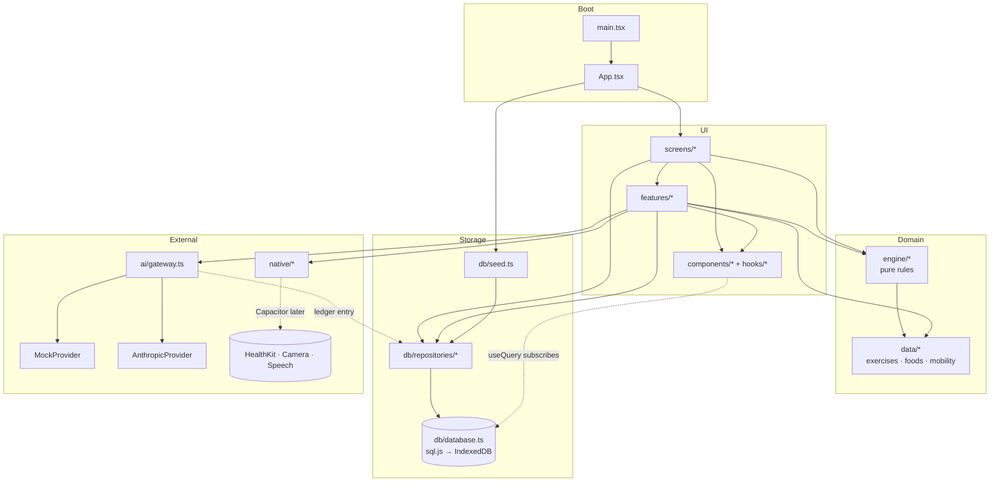
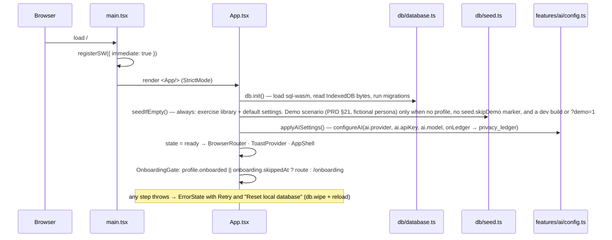
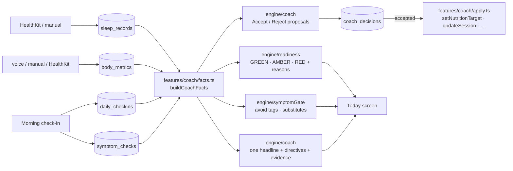

# Architecture

Local-first personal fitness coach. One user, one device, no account. The SQLite database on the phone is the system of record; cloud AI is an optional processor that only ever sees what the privacy ledger says it saw.

## Layers

| Layer | Directory | Rule |
|---|---|---|
| Screens | `src/screens/` | One file per route (see `docs/CONTRACTS.md`). Read via `useQuery`, write via repositories, never touch SQL. |
| Features | `src/features/` | Cross-screen flows: coach facts/apply, meal capture, voice sheet, workout logger pieces, AI settings. |
| UI kit + hooks | `src/components/`, `src/hooks/` | Tailwind v4 tokens, iOS-native feel, dark-mode aware. `useQuery` re-runs on every committed write. |
| Engine | `src/engine/` | Pure, deterministic, unit-tested: readiness, symptom gate, progression, nutrition targets/trends, planner, voice parser, coach priority/proposals. **No db or React imports.** |
| Data | `src/data/` | Bundled exercise library (84), Singapore + generic foods (215), mobility routines (11). |
| Repositories | `src/db/repositories/` | Synchronous typed access to every table; row mapping is internal. |
| Database | `src/db/database.ts`, `schema.ts`, `seed.ts` | sql.js (WASM SQLite) persisted to IndexedDB; ordered migrations; reference data on every boot, fictional demo seed in dev or with `?demo=1` (`shouldSeedDemo`). |
| AI | `src/ai/` | Provider abstraction (`mock`, `anthropic`) behind a gateway that checks connectivity, times out, and writes the privacy ledger. |
| Native | `src/native/` | Bridges for HealthKit (web stub + Capacitor swap notes), camera, speech, notifications, wake lock. |
| Boot | `src/main.tsx`, `src/App.tsx` | PWA service worker, boot state machine, router, onboarding guard + setup gate, shell, error boundary. |

## Module map

Import direction is strictly downward: screens → features → engine/data/repositories → database. The engine never imports from `db/`, `ai/`, `native/` or React, which is what keeps every safety rule and every number auditable in unit tests.

## Boot sequence

## Daily data flow (Today screen)

## Write path and reactivity

1. A screen calls a repository function (synchronous; sql.js runs in-process).
2. `db.run`/`db.transaction` marks the database dirty, notifies subscribers once per commit, and schedules a debounced (250 ms) export of the whole database to IndexedDB.
3. `useQuery(fn, deps)` is a `useSyncExternalStore` over that subscription: every mounted query re-runs synchronously during render, so screens never hold stale copies of the data.

Multi-row writes (meals with items, seeding, reseeding, exercise upserts) run inside `db.transaction` so they are atomic and produce a single notification.

## Safety boundary

- **Setup gate.** The intake can be skipped (`onboarding.skippedAt`), but `profile.onboarded` stays the only key: `features/onboarding/setup.ts` locks starting a workout or mobility routine and every photo capture (meal, progress, report) until the intake is committed, so no session, target or photo is ever written against a profile the coach has never seen.
- **Deterministic first.** Readiness thresholds, red-flag rules, symptom → avoid-tag mapping, double progression, calorie/protein estimates and trend adjustments are pure functions in `src/engine/` with tests.
- **AI proposes, never mutates.** The LLM system prompt forbids calorie math and plan changes; any material change surfaces as a `CoachDecision` with rationale + evidence and requires Accept/Reject. Only `features/coach/apply.ts` applies an accepted decision.
- **Everything that leaves the device is logged.** `ai/gateway.ts` is the single choke point: offline check → provider call with 60 s timeout → `privacy_ledger` row (provider, data type, purpose, bytes, sent/failed/local_only).

## Persistence and portability

- sql.js keeps the whole database in memory; the exported byte image lives in IndexedDB (`coach-local` / `sqlite` / `main.db`). Export is the same byte image (`exportSqlite`) or a JSON dump of every table (`exportJson`).
- `db/schema.ts` is an ordered migration list; the applied version is stored in the `meta` table. Adding a column means appending a migration, never editing an existing one.
- Under Capacitor, `db/database.ts` is the one file to swap for `@capacitor-community/sqlite`; repositories and everything above stay unchanged.

## Native bridges (web now, Capacitor later)

| Capability | Web build | iOS shell |
|---|---|---|
| Sleep, body mass, resting HR, workouts | `WebHealthBridge` reports unavailable; manual entry everywhere | HealthKit plugin implementing `HealthBridge` (see the comment block in `native/health.ts`), registered with `setHealthBridge()` |
| Meal photo | `<input type=file capture=environment>` → canvas downscale to ≤1280 px JPEG | Same, or `@capacitor/camera` |
| Voice | Web Speech API (on-device where the OS provides it); text fallback when unavailable | Same API inside WKWebView |
| Notifications | Notification API via service worker | `@capacitor/local-notifications` |
| Keep awake during workouts | Screen Wake Lock API | `@capacitor-community/keep-awake` |
| Secrets | `settings` table (plain) — see README limitations | iOS Keychain |
